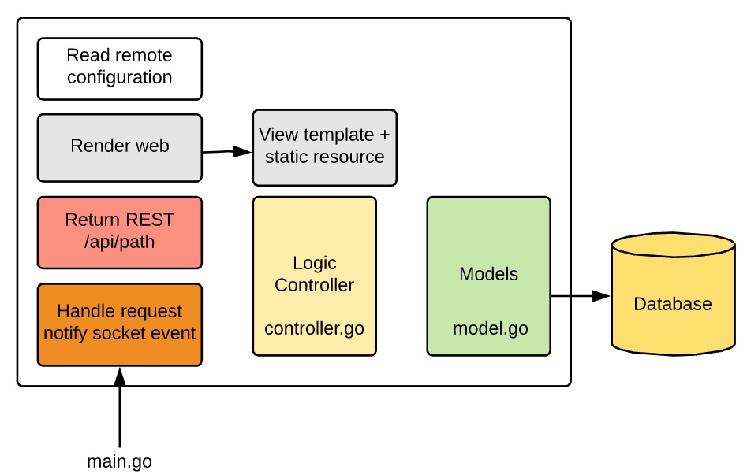

# Đây là demo cho một dịch vụ Web viết bằng Golang
Dịch vụ (microservice) sử dụng những thư viện như sau:
1. [iris](https://iris-go.com) để lập trình web MVC
  - Hãy sử dụng pongo2 template
  - Định nghĩa các model kiểu struct
  - Xuất ra REST API tương ứng
2. [go-pg](https://github.com/go-pg/pg) để kết nối vào cơ sở dữ liệu

Các yêu cầu khác:
1. Demo đầy đủ Create - Read - Update - Delete. Giao diện không cần CSS. Xấu ok !
2. Cấu trúc file, chức năng như hình vẽ dưới đây
